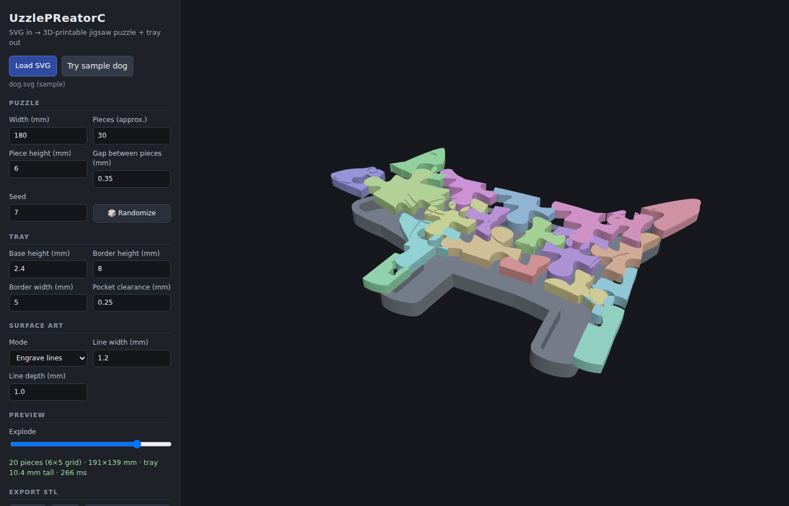

# UzzlePReatorC

Turn a line-art SVG (think crayon coloring page) into a **3D-printable jigsaw
puzzle with a matching tray** — entirely in your browser.

Upload an SVG of, say, a dog. You get a dog-shaped jigsaw puzzle cut by a
traditional randomized knob-and-tab grid, plus a dog-shaped tray the pieces
drop into.



## Features

- **SVG in → STL out.** Everything runs client-side; no uploads, no server.
- **Traditional jigsaw cut.** A randomized interlocking grid (classic
  knob/tab curves, seedable) is fit to the SVG's silhouette and used as the
  cutting tool. Slivers at the outline are merged into neighbouring pieces.
- **Printable gaps.** Every piece is inset by half the gap width so
  neighbours actually fit after printing.
- **Tray generator.** Silhouette-shaped pocket with configurable
  *base height* (floor under the pieces), *border height* (wall above the
  floor), *border width*, and pocket clearance.
- **Name puzzles.** Type a name (built-in font, or upload a .ttf/.otf/.woff)
  and get the classic kids' puzzle: each letter is a whole piece fitting a
  letter-shaped pocket in a rounded board — or jigsaw-cut the text instead.
- **Surface art.** The SVG's interior lines can be **engraved** into or
  **embossed** onto the piece tops so the assembled puzzle still shows the
  picture — or leave tops plain.
- **Live 3D preview** with an explode slider (three.js).
- **Exports:** pieces STL, tray STL, both side by side, or a single
  **3MF** with the tray and every piece as separate named objects
  (`tray`, `piece-01`, ...). Millimetre units, Z-up, watertight shells.

## Usage

Serve the folder with any static file server and open it:

```sh
npm run serve          # python3 -m http.server 8000
# then open http://localhost:8000
```

Click **Try sample dog** or load your own SVG. Tweak parameters — the model
regenerates live. Export STLs and slice as usual (touching stacked shells
are merged by the slicer).

### Parameters

| Parameter | Meaning |
| --- | --- |
| Width | Puzzle silhouette is scaled to this width (mm) |
| Pieces | Approximate piece count; a roughly-square grid is chosen |
| Piece height | Extrusion height of the pieces |
| Gap | Total clearance between neighbouring pieces |
| Seed | Random seed for the tab layout (🎲 rerolls) |
| Base height | Tray floor thickness under the pieces |
| Border height | Tray wall height above the floor |
| Border width | Tray wall thickness |
| Pocket clearance | Extra room between pieces and the tray wall |
| Surface art | Engrave / emboss the SVG's lines on piece tops, or plain. *Emboss + fill* raises the closed artwork shapes as solid plateaus instead of outline ridges (open lines still emboss as strokes) |

### SVG tips

- The **outer silhouette** is taken from the union of all closed shapes.
  If the drawing is stroke-only with unclosed outlines, a fallback fattens
  all lines and uses the filled outer contour.
- Interior lines (open or closed) become the engraved/embossed artwork.
- Very small features (thin tails, whiskers) may be merged or dropped —
  warnings are shown when that happens.

## Development

```sh
npm test   # node tests/pipeline.test.mjs — DOM-free geometry pipeline
```

The geometry core (`src/geom/`) is plain ES modules with no DOM
dependencies: clipper-based 2D booleans/offsets, the jigsaw grid generator,
the puzzle/tray pipeline, and the extrusion mesher. Browser-only code lives
in `src/svgload.js` (SVG sampling), `src/preview.js` (three.js viewer) and
`src/main.js` (UI).

Vendored libraries (`vendor/`): [three.js](https://threejs.org) (MIT),
[earcut](https://github.com/mapbox/earcut) (ISC),
[clipper-lib](https://sourceforge.net/projects/jsclipper/) (Boost 1.0).

## Roadmap

- Piece numbering embossed on the undersides
- Alternative cut patterns (Voronoi, region-based)
